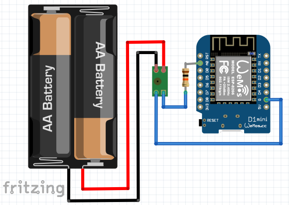
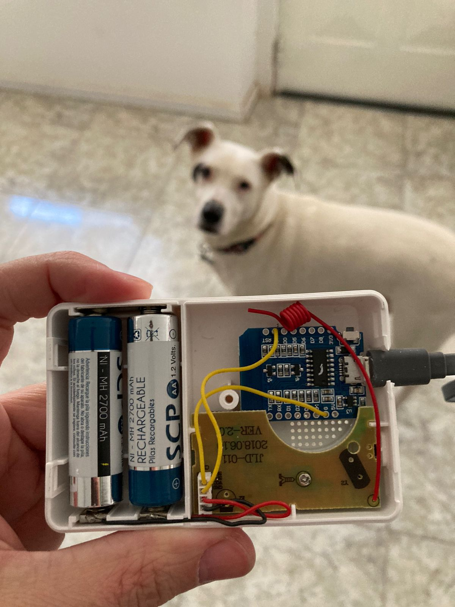

# timbre-wifi

Timbre WiFi hecho con 2 mangos, te manda una notificación de Telegram cuando aprietan el pulsador. No inventé nada, [acá](https://github.com/witnessmenow/push-notifications-arduino-esp8266) la idea original, solo le sumé un timbre inalámbrico.

> Estas son notas para el futuro yo que va a intentar debuguear esta chanchada.

## Requerimientos

### Hardware

- **Timbre Inalambrico Sanderson QD-W003** (USD ~ $14.6), compré el más genérico en [MeLi](https://articulo.mercadolibre.com.ar/MLA-903109496-timbre-inalambrico-exterior-resistente-agua-200m-sanderson-_JM), supongo que funciona con otros.
- **ESP8266 Wemos D1 Mini** (USD ~ $5.8), se consigue en [MeLi](https://articulo.mercadolibre.com.ar/MLA-679862721-modulo-nodemcu-wemos-d1-mini-wifi-esp8266-esp12f-4mb-arduino-_JM).

### Software

- [Librería para ESP8266](https://github.com/esp8266/Arduino)
  - Agregar `https://arduino.esp8266.com/stable/package_esp8266com_index.json` en `File > Preferences > Additional Boards Manager URLs`.
- Librería [Universal-Arduino-Telegram-Bot](https://github.com/witnessmenow/Universal-Arduino-Telegram-Bot).
- Librería [ArduinoJson](https://github.com/bblanchon/ArduinoJson).

## Qué hice

El [proyecto original](https://github.com/witnessmenow/push-notifications-arduino-esp8266) usaba un pulsador para mandarle 3.3V a un pin digital.

Aparentemente estos porteros inalambricos una vez que les llega la señal del pulsador modulan pulsaciones de entre 1V y 2V y eso es lo que hace que suene el parlantito con el timbre, entonces le desconecté el parlante y le mandé eso a la ESP8266. Como el voltaje no es continuo, en vez de pasarselo a un pin digital se lo mandé al pin analogico y le puse un umbral para que si se pasa (cuando se aprieta el pulsador) corra la función del bot.

[Acá](timbre-wifi.ino) el código.

## Schema

